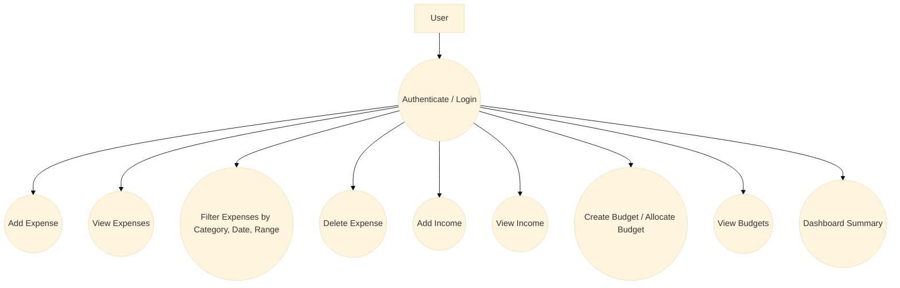
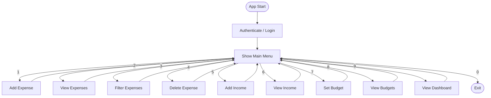
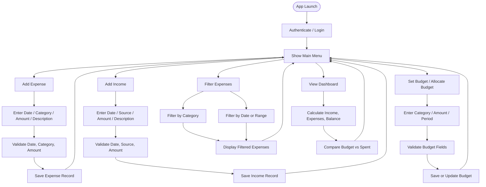
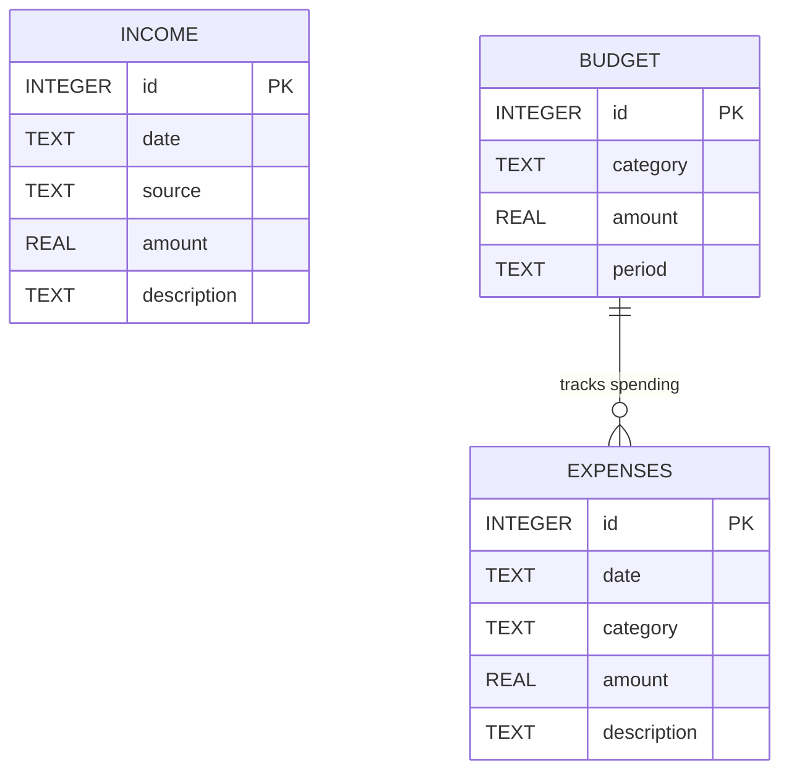
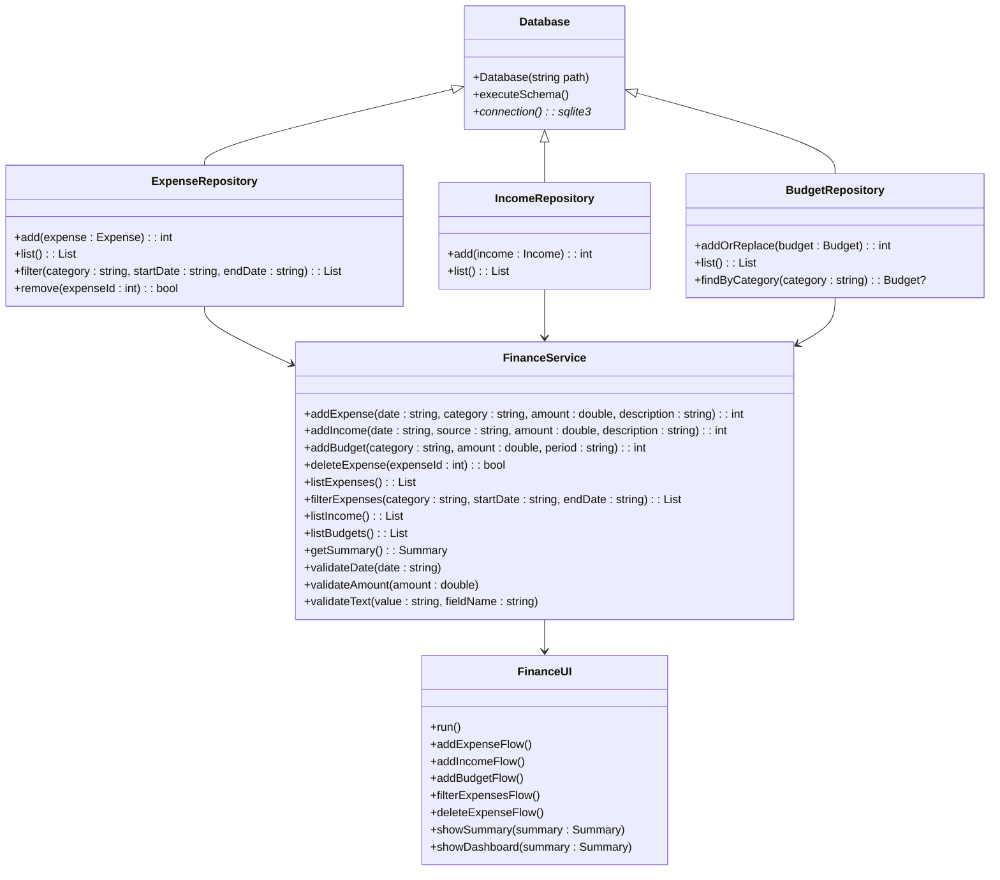

# Personal Finance Manager Design Document

## 1. Overview
The Personal Finance Manager is a console-based application for tracking expenses, income, and budgets with SQLite persistence. Its design emphasizes clean architecture, separation of concerns, and extensibility.

## 2. Goals
- Maintain clear separation between UI, business logic, and persistence
- Support expense and income recording, filtering, and deletion
- Filter expenses by category and date range
- Track budgets and provide dashboard-style summary insight with budget status
- Persist data across restarts using SQLite
- Keep validation centralized and behavior predictable

## 3. Architecture
The system is organized into the following layers:

- **Database**: Responsible for SQLite connection management and schema initialization.
- **Repository**: Encapsulates CRUD operations for expenses, income, and budgets.
- **Service**: Implements business rules, validation, and summary calculations.
- **UI**: Handles user interaction, input prompts, and command dispatch.

## 4. Data Model
The core entities are:
- `Expense` — date, category, amount, optional description
- `Income` — date, source, amount, optional description
- `Budget` — category, amount, period

### Database tables
- `expenses(id, date, category, amount, description)`
- `income(id, date, source, amount, description)`
- `budgets(id, category, amount, period)`

## 5. UML Diagrams

### 5.1 Use Case Diagram

### 5.2 Flow Diagram

### 5.3 Activity Diagram

### 5.4 ER Diagram

### 5.5 Class Diagram

## 6. Design Principles
- **Single Responsibility**: Each class handles one layer of concern.
- **Separation of Concerns**: UI is separate from business logic and persistence.
- **Modularity**: Repositories and services are interchangeable and easy to extend.
- **Validation-first**: All input is validated before persistence.
- **Persistence Layer**: SQLite is isolated behind `Database` and repository classes.
- **Extensibility**: New reports, export targets, or UI modes can be added without changing core services.

## 7. Recommended Document Use
- Insert the Mermaid blocks directly into markdown or documentation tools that support Mermaid.
- Use the use case diagram for stakeholder requirements.
- Use the flow and activity diagrams for implementation planning.
- Use the ER diagram to describe the database schema.
- Use the class diagram to explain the code structure.
